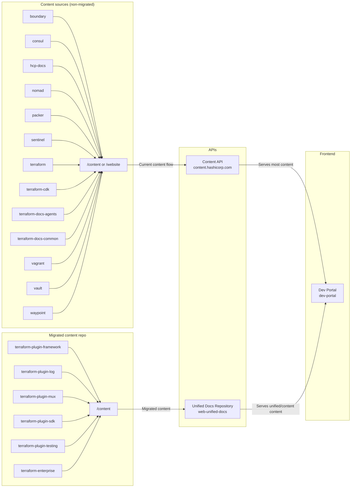

# Web Unified Docs

The project in this repository, `hashicorp/web-unified-docs`, aims to implement [[DEVDOT-023] Unified Product Documentation Repository](https://docs.google.com/document/d/1p8kOqySttvWUVfn7qiC4wGBR73LMBGMelwLt69pM3FQ/edit). The RFC for this project was intentionally light on implementation details, in order to foster consensus on the broad direction.

- **PR previews**: Show broken links in comments for awareness (informational only, don't block PRs)
- **Production monitoring**: Weekly scans create GitHub issues and send critical alerts to Datadog when users are affected

The weekly [`broken-link-check-full`](https://github.com/hashicorp/web-unified-docs/blob/main/.github/workflows/broken-link-check-full.yml) workflow generates comprehensive broken link reports with prioritization guidance. When contributors create PRs that modify content, the link checker shows any broken links in PR comments with actionable guidance without blocking development.

**Quick tips for contributors**:

- **Fix internal HashiCorp links** (high priority)
- **Check external docs/API links** (medium priority)
- **Consider removing unreliable external links** (low priority)

For detailed information about the monitoring system, see [Broken Link Monitoring Documentation](./.github/BROKEN_LINK_MONITORING.md). Unified Product Documentation Repository](https://docs.google.com/document/d/1p8kOqySttvWUVfn7qiC4wGBR73LMBGMelwLt69pM3FQ/edit). The RFC for this project was intentionally light on implementation details, in order to foster consensus on the broad direction.

The existing API (`content.hashicorp.com`) has endpoints that serve documentation content. You can find the source code in [hashicorp/mktg-content-workflows](https://github.com/hashicorp/mktg-content-workflows/blob/main/api/content.ts).

The goal of the unified docs API is to host all of HashiCorp's product documentation. The unified docs API will eventually replace the existing content API.

## Local development

### Requirements

- [Docker](https://www.docker.com/) and [Docker Compose](https://docs.docker.com/compose/) (for managing containers)

### Quick start

To get a migration preview running, run `make` from the root of this repo. The `make` command starts the `unified-docs` Docker profile that spins up a local instance of `unified-devdot-api` and `dev-portal`.

Once this command completes, you can access the following endpoints:

- http://localhost:3000 - An instance of the `dev-portal` container configured to pull from the experimental docs API (this repo). This image depends on the unified docs API (`unified-devdot-api`).

- http://localhost:8080 - An instance of the unified docs API container (this repo - `unified-devdot-api`) that serves content from the `content` directory. On startup, this container processes the content and assets in `/content` into `public/assets` and `public/content`. In addition, the container also generates `app/api/docsPaths.json` and `app/api/versionMetadata.json` from the contents within `/content`.

  Use the following example to test this endpoint: http://localhost:8080/api/content/terraform-plugin-framework/doc/latest/plugin/framework

> [!NOTE]
> The unified docs API container takes time to process the content and assets. You must wait for both the `unified-devdot-api` and `dev-portal` containers to complete before you can successfully test content in the `dev-portal` preview environment (`localhost:3000`). Visit http://localhost:8080/api/all-docs-paths to verify the `unified-devdot-api` container is complete.

To spin this down gracefully, run `make clean` in a separate terminal.

If you wish to remove the local Docker images as well, run `make clean CLEAN_OPTION=full`.

### More commands

The `makefile` serves as a convenience tool start the local preview. If you need more granular control, the `package.json` file contains a full list of available commands.

To use these, you will need to intentionally run `npm install` and `npm run prebuild` before anything else.

Use `npm run coverage` to run coverage tests.

### Preview environments for unified-docs and dev-portal

Unified docs API serves as one of the content APIs for `dev-portal` (frontend application for DevDot). As a result, when implementing new features, you may need to modify both the backend (this repo) and the frontend (`dev-portal`).

If you are working on a ticket that requires changes to both the unified docs API and `dev-portal`, please set [custom environment variables for your branch](https://vercel.com/hashicorp/dev-portal/settings/environment-variables) in Vercel to simplify testing instructions.

For example, in Vercel, for your `dev-portal` branch, you can set the following environment variables:

| Environment variable | Value                  |
| -------------------- | ---------------------- |
| `HASHI_ENV`          | `unified-docs-sandbox` |
| `UNIFIED_DOCS_API`   | `<UDR-Preview-URL>`    |

Vercel will use these values to create deploy previews.

### API development

Reach out to team #team-web-presence if you need to do local API development

## Background

### Project Rationale

- Storing documentation in one branch of one repo dramatically simplifies the workflow for contributing documentation.
- Publishing changes to multiple versions can be done in a single PR, as opposed to multiple PRs which is required by the current setup.
- Finding and making the same change across multiple versions is as simple as doing a find-and-replace since all the versioned docs are on the filesystem at the same time.
- Adding a new product is as easy as making a new folder, as opposed to the current process which requires code-changes on the API side and the installation of a GitHub App to monitor for events.
- Sourcing from one branch in one repo eliminates the situation where a missed GitHub event can result in out-of-date documentation. If something goes wrong in the publishing process, simply run it again instead of relying on incoming commit/release events from the GitHub API.
- Since we can make edits to all docs for all products and versions from a single PR, making platform-level changes is dramatically simplified (such as updating to MDX v2, or rewriting URLs).
- Adding new features like content conformance (basically linting for docs) can be done for the entire codebase at once.
- Removes the ability for docs to break the release workflow in product repos.
- Enables us to support fully versioned deployment previews, whereas current previews are limited to the branch being modified.

### [Architectural Decision Records](https://github.com/hashicorp/web-unified-docs/tree/main/docs/decisions)

## Update product repo documentation

This script helps with product documentation migration to the web-unified-docs repository. When migrating documentation:

1. The `web-unified-docs` repository becomes the source of truth
2. Original documentation may remain temporarily as a fallback
3. Users should be directed to make future changes in `web-unified-docs` only

This script automatically adds a prominent notice to all MDX files in the original location, informing contributors where to make future changes.

```
./scripts/update-mdx-files.sh ~/Desktop/hashicorp/terraform-plugin-framework/website/docs
```

Example output:

```
Progress:

Files processed: 135
Files updated: 135
Files with no frontmatter: 0
Files with errors: 0

Completed! All MDX files have been processed.
```

## Run broken link checker locally

The repository uses a focused broken link monitoring system:

- **PR previews**: Show broken links in comments for awareness (informational only, don't block PRs)
- **Production monitoring**: Weekly scans create GitHub issues and Datadog alerts for user-facing problems

The weekly [`broken-link-check-full`](https://github.com/hashicorp/web-unified-docs/blob/main/.github/workflows/broken-link-check-full.yml) workflow generates comprehensive broken link reports. When contributors create PRs that modify content, the link checker shows any broken links in PR comments without blocking development.

For detailed information about the monitoring system, see [Broken Link Monitoring Documentation](./.github/BROKEN_LINK_MONITORING.md).

### UDR Migration Link Check

For teams migrating products to UDR (Unified Docs Renderer), use the dedicated migration workflow:

1. Go to [Actions → UDR Product Link Check](https://github.com/hashicorp/web-unified-docs/actions/workflows/udr-product-link-check.yml)
2. Click "Run workflow" and select your product
3. Review migration-specific broken link analysis in the generated GitHub issue

This workflow provides targeted link checking with migration-focused reporting and prioritization.

### Local Testing

You can also run the broken link checker locally. The following commands launch a lychee Docker container to check the content directories you specify.

Run the broken link checker on all content.

```
npm run broken-link
```

Check a specific directory within content.

```
npm run broken-link terraform-plugin-framework
```

Check multiple directories.

```
npm run broken-link terraform-plugin-framework-log terraform-plugin-mux
```

## Contributing to the content

Follow the [style guide](docs/style-guide/index.md) when making changes to documentation or tutorials. The [top 12 guidelines](docs/style-guide/top-12.md) covers the most common use cases.

Work with your technical writer or education engineer when adding new content or for updates that may include structural changes to the information.

Adherence to the style guide and our writing principles ensures that our content is clear, concise, and consistent.

## Architecture

The following diagram illustrates the relationships between the unified docs API (this repo), `dev-portal`, and the existing content API:



The diagram shows:

- The content API — the existing system that sources product documentation content from product repositories
- The unified docs API — the new system that sources product documentation from this repo's `/content` directory. The migrated repos will use a directory approach to versioning (rather than the historic branch and tag strategy)
- The Dev Portal — the frontend that serves the main DevDot interface. Dev Portal sources its content from both the existing content API and unified docs API.
